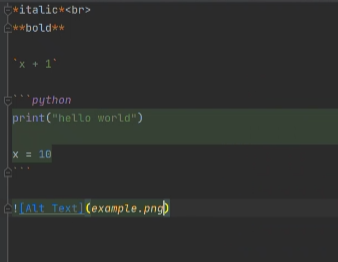

# Python Fundamentals

### *Variables*
Variable -> Label data within a program and share it, so it can be referenced later.

#### Python is a dynamically typed language.

<br>

### *Operators*
Operators = symbols that execute a particular mathematical or logical function.

- Arithmetical Operators: +, -, *, /, %
- Logical (Comparison) Operators: >, <, ==, !=, >=, <=

<br>

### *Numeric Types*
- integer (int)
- float
- complex


##### Rounding examples:
```python
pi = 3.1415926535
print(f"{pi:3f}") # prints out 3.142

score = 15.5
max_score = 24
print(f"Score percentage: {score/max_score:%}") # prints 64.58333333%
print(f"Score percentage: {score/max_score:.2%}") # prints 64.58%
print(f"Score percentage: {score/max_score:.0%}") # prints 65%

``` 

<br>

### *Useful string methods*
- `my_string.isalpha()` -> checks if all characters are letters
- `my_string.islower()` -> checks if all characters are lowercase
- `my_string.endswith("!")` -> checks if string ends with "!"

<br>

### *Value of None*
- **null** in other languages
- Used as a **placeholder value**
```python
z = None
print(bool(z)) # prints False
print(z is None) # prints True, and this is the best practice
print(type(z)) # prints class<'NoneType'>
```

<br>

### *Collections*
=> **Can store multiple pieces of data.**
- **Lists** (*arrays* in other languages); useful methods:
  - `.append()`
  - `.extend()`
- **Tuples** -> *immutable*, they cannot be changed.
```python
essentials = ("bread", "eggs", "milk")
print(type(essentials)) # prints class<'tuple'>
```
- **Dictionaries** -> they use *key/value* pairs
  - Key = the reference to the object
  - Value = the data storage mechanism you want to use
- **Sets** -> NO order and NO duplicates
```python
my_set = {"wheels", "doors", "steering_wheel", "handles"}
my_set.add("gear")
my_set.discard("doors")
```
- **Frozen Sets** - immutable sets; ex:
`x = frozenset([1, 2, 3, 4, 5])`

<br>

### *More useful tips:*

