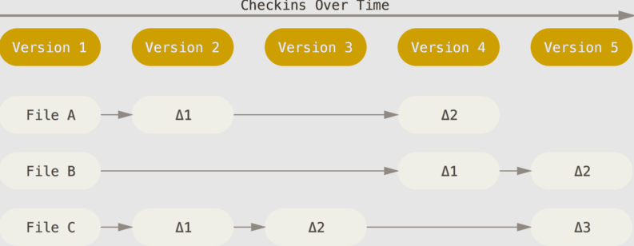
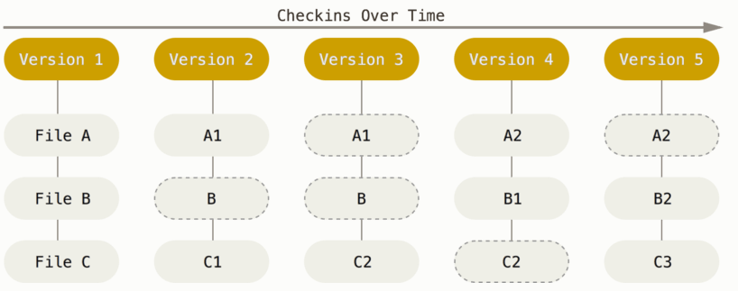
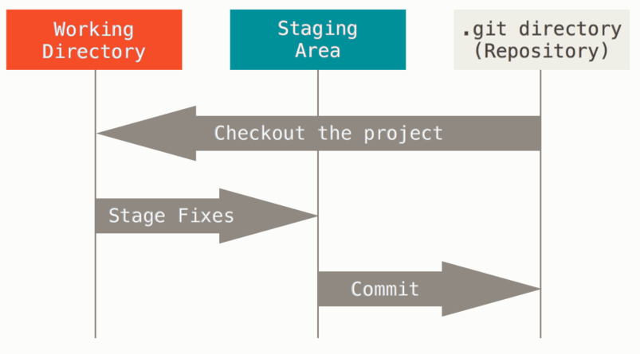

# What is Git?

### *Snapshots, Not Differences*
 - The major difference between Git and any other VCS (Version Control System) is the way Git thinks about its data. 

 - Conceptually, most other systems store information as a list of file-based changes. They think of the information they store as **a set of files** and the changes made to *each file* over time (this is commonly described as *delta-based version control*):

 
 - Git thinks of its data more like a **series of snapshots of a miniature filesystem**. 

 - Every time you commit, or save the state of your project, Git basically **takes a picture of what all your files look like at that moment** and stores a reference to that snapshot. 

 - To be efficient, if files have not changed, Git *doesn’t store the file again*, just a link to the previous identical file it has already stored. Git thinks about its data more like **a stream of snapshots**:

 

### *Nearly Every Operation Is Local*
- Most operations in Git need **only local files** and resources to operate - generally no information is needed from another computer on your network.
- Because you have the entire history of the project right there on your local disk, most operations **seem almost instantaneous**.

 

### *Git Has Integrity*
- Everything in Git is *checksummed* before it is stored and is then referred to by that checksum.
- It’s **impossible** to change the contents of any file or directory without Git knowing about it.
- You **can’t lose information** in transit or get file corruption without Git being able to detect it.
- The mechanism that Git uses for this checksumming is called a *SHA-1 hash*. This is a 40-character string composed of hexadecimal characters (0–9 and a–f) and calculated based on the contents of a file or directory structure in Git.

 

### *Git Generally Only Adds Data*
- When you do actions in Git, nearly all of them only **add** data to the Git database. It is hard to get the system to do anything that is **not undoable** or to make it erase data in any way. 
- After you commit a snapshot into Git, it is *very difficult to lose*, especially if you regularly push your database to another repository.

 

### *The Three States*
#### Git has three main states that your files can reside in: *modified, staged, and committed*:

- **Modified** means that you have changed the file but have not committed it to your database yet.

- **Staged** means that you have marked a modified file in its current version to go into your next commit snapshot.

- **Committed** means that the data is safely stored in your local database.

This leads us to the three main sections of a Git project: **the working tree, the staging area, and the Git directory.**

 

### *Working tree, staging area, and Git directory*

- **The working tree** is a single checkout of one version of the project. These files are *pulled out* of the compressed database in the Git directory and *placed on disk* for you to use or modify.

- **The staging area** is *a file*, generally contained in your Git directory, that stores information about what will go into your next commit. Its technical name in Git parlance is the *“index”*, but the phrase *“staging area”* works just as well.

- **The Git directory** is where Git stores the metadata and object database for your project. This is *the most important part of Git*, and it is what is **copied** when you *clone* a repository from another computer.

 

### *The basic Git workflow*
 

1. You **modify files** in your *working tree*.

2. You selectively **stage** just those changes you want to be part of your next commit, which adds *only those changes* to the staging area.

3. You **do a commit**, which takes the files as they are in the staging area and stores that snapshot *permanently* to your Git directory.

 

Source: [What is Git? - git-scm.com](https://git-scm.com/book/en/v2/Getting-Started-What-is-Git%3F#:~:text=Git%20has%20three%20main%20states,into%20your%20next%20commit%20snapshot.)