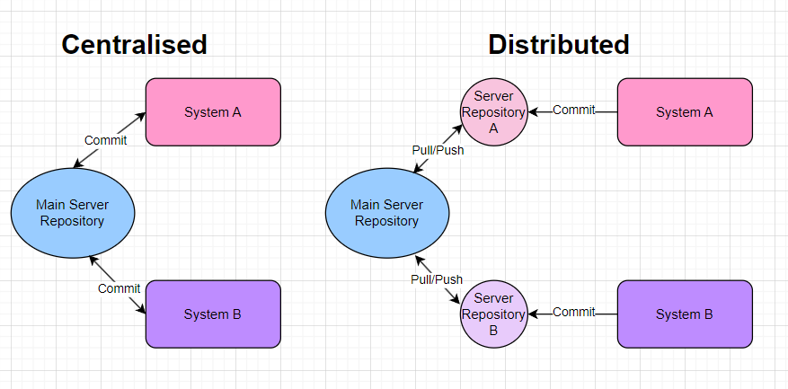
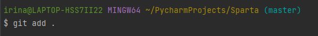
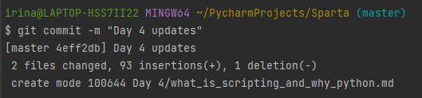
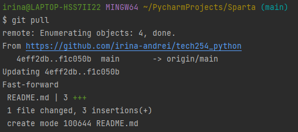
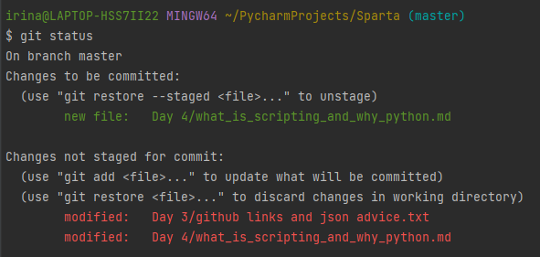
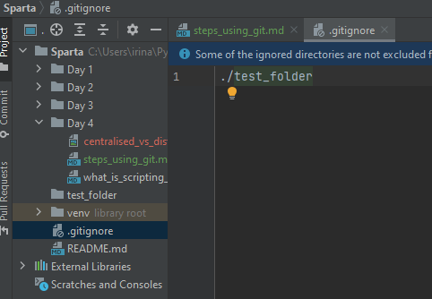

# Steps for using Git and GitHub



### Steps for setting up and committing to a repository:
1. **initialising**: `git init` -> This creates all the necessary Git metadata for the new repository.

2. **adding**: `git add .` -> This will add all folders to staging.

3. **committing**:  `git commit -m "..."` 


*What this does:*
- This will commit everything to the repository. 
- After the last command, `git status` will show "Nothing to commit, working tree clean". 
- Usually, you should add "First commit" comment to your first commit to the repository.
4. **pulling**: `git pull` -> This will pull anything from the online repository to the local unit.


<br>

Other useful commands / notes:
- `git status` -> it will give you the current status of the repository.

- `git log` -> it will show all the commits.
- Creating a `.gitignore` file in the tracked folder, and any folders added to that file (in the form of `./folder_name`) will NOT be tracked.


<br>

### Push an existing repository from the command line

```
git remote add origin https://github.com/irina-andrei/tech254_python.git
git branch -M main
git push -u origin main
```


