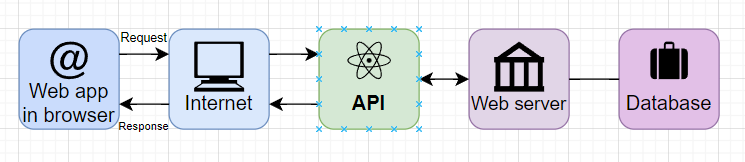
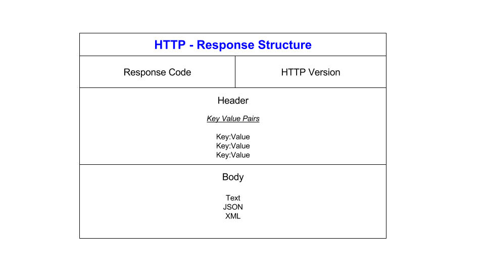

# What are API’s?
API stands for Application Programming Interface, which is a set of definitions and protocols for building and integrating application software.

 

### How are APIs used and why are they so popular?
APIs let your product or service communicate with other products and services without having to know how they’re implemented. This can simplify app development, saving time and money.

They are so popular because when you’re designing new tools and products, APIs:
- give you flexibility
- simplify design, administration, and use
- provide opportunities for innovation.

This diagram showcases the data transfer process in API communication. 

 

### What is a REST API? 
A REST API (also known as RESTful API) is an application programming interface (API or web API) that conforms to the constraints of REST architectural style and allows for interaction with RESTful web services. REST stands for 'REpresentational State Transfer' and was created by computer scientist Roy Fielding.

REST is a set of architectural constraints, not a protocol or a standard. API developers can implement REST in a variety of ways.

When a client request is made via a RESTful API, it transfers a representation of the state of the resource to the requester or endpoint. This information, or representation, is delivered in one of several formats via HTTP: JSON (Javascript Object Notation), HTML, XLT, Python, PHP, or plain text. JSON is the most generally popular file format to use because, despite its name, it’s language-agnostic, as well as readable by both humans and machines. 

Something else to keep in mind: Headers and parameters are also important in the HTTP methods of a RESTful API HTTP request, as they contain important identifier information as to the request's metadata, authorization, uniform resource identifier (URI), caching, cookies, and more. There are request headers and response headers, each with their own HTTP connection information and status codes.

 

### What makes an API RESTful?
In order for an API to be considered RESTful, it has to conform to these criteria:
- A client-server architecture made up of clients, servers, and resources, with requests managed through HTTP.
- Stateless client-server communication, meaning no client information is stored between get requests and each request is separate and unconnected.
- Cacheable data that streamlines client-server interactions.
- A uniform interface between components so that information is transferred in a standard form. This requires that:
1. resources requested are identifiable and separate from the representations sent to the client.
2. resources can be manipulated by the client via the representation they receive because the representation contains enough information to do so.
3. self-descriptive messages returned to the client have enough information to describe how the client should process it.
4. hypertext/hypermedia is available, meaning that after accessing a resource the client should be able to use hyperlinks to find all other currently available actions they can take.
- A layered system that organizes each type of server (those responsible for security, load-balancing, etc.) involved the retrieval of requested information into hierarchies, invisible to the client.
- Code-on-demand *(optional)*: the ability to send executable code from the server to the client when requested, extending client functionality. 

### What is HTTP? (what does it stand for and what is it used for? What is HTTPS?)
The **Hypertext Transfer Protocol** (HTTP) is the foundation of the World Wide Web, and is used to load webpages using hypertext links. HTTP is an application layer protocol designed to transfer information between networked devices and runs on top of other layers of the network protocol stack. A typical flow over HTTP involves a client machine making a request to a server, which then sends a response message.

Hypertext transfer protocol secure (HTTPS) is the secure version of HTTP, which is the primary protocol used to send data between a web browser and a website. HTTPS is encrypted in order to increase security of data transfer. This is particularly important when users transmit sensitive data, such as by logging into a bank account, email service, or health insurance provider.

 

### HTTP Request Structure:

HTTP headers contain text information stored in key-value pairs, and they are included in every HTTP request (and response, more on that later). These headers communicate core information, such as what browser the client is using and what data is being requested.

Example of HTTP request headers from Google Chrome's network tab:

HTTP request headers
What is in an HTTP request body?
The body of a request is the part that contains the ‘body’ of information the request is transferring. The body of an HTTP request contains any information being submitted to the web server, such as a username and password, or any other data entered into a form.

 

### HTTP Response Structure:

An HTTP response is what web clients (often browsers) receive from an Internet server in answer to an HTTP request. These responses communicate valuable information based on what was asked for in the HTTP request.

A typical HTTP response contains:

an HTTP status code
HTTP response headers
optional HTTP body

#### What’s an HTTP status code?
HTTP status codes are 3-digit codes most often used to indicate whether an HTTP request has been successfully completed. Status codes are broken into the following 5 blocks:

1xx Informational
2xx Success
3xx Redirection
4xx Client Error
5xx Server Error
The “xx” refers to different numbers between 00 and 99.

Status codes starting with the number ‘2’ indicate a success. For example, after a client requests a webpage, the most commonly seen responses have a status code of ‘200 OK’, indicating that the request was properly completed.

If the response starts with a ‘4’ or a ‘5’ that means there was an error and the webpage will not be displayed. A status code that begins with a ‘4’ indicates a client-side error (it is very common to encounter a ‘404 NOT FOUND’ status code when making a typo in a URL). A status code beginning in ‘5’ means something went wrong on the server side. Status codes can also begin with a ‘1’ or a ‘3’, which indicate an informational response and a redirect, respectively.

What are HTTP response headers?
Much like an HTTP request, an HTTP response comes with headers that convey important information such as the language and format of the data being sent in the response body.

Example of HTTP response headers from Google Chrome's network tab:

HTTP response headers
What is in an HTTP response body?
Successful HTTP responses to ‘GET’ requests generally have a body which contains the requested information. In most web requests, this is HTML data that a web browser will translate into a webpage.

 

### The 5 HTTP Verbs 
1. **GET** -> used to request data from a specified resource. 
- It can be cached
- It remains in the browser history
- it can be bookmarked
- it should never be used when dealing with sensitive data
- it has length restrictions
only used to request data (not modify)
2. **POST** -> used to send data to a server to create/update a resource. The data sent to the server with POST is stored in the request body of the HTTP request.
- it's never cached
- it does not remain in the browser history
- it cannot be bookmarked
- it has no restrictions on data length
3. **PUT** -> used to send data to a server to create/update a resource.
- The difference between POST and PUT is that PUT requests are idempotent. => calling the same PUT request multiple times will always produce the same result. 
- In contrast, calling a POST request repeatedly have side effects of creating the same resource multiple times.
4. **PATCH** -> used to apply partial modifications to a resource.
5. **DELETE** -> deletes the specified resource.

 

### What is statelessness?
HTTP is a "stateless" protocol which means each time a client retrieves a Webpage, the client opens a separate connection to the Web server and the server automatically does not keep any record of previous client request.
 

### What is caching?
HTTP Caching is a technique used to improve website performance. HTTP Caching can be implemented by the client, server, an intermediate node such as a proxy, or any combination of these.

Sources: 
- [What is an API - redhat.com](https://www.redhat.com/en/topics/api/what-are-application-programming-interfaces)
- [How API works - altexsoft.com](https://www.altexsoft.com/media/2019/06/1.png)
- [Diagram creator](https://app.diagrams.net/)
- [What is REST API - redhat.com](https://www.redhat.com/en/topics/api/what-is-a-rest-api)
- [What is HTTP? Request and Response structure - cloudflare](https://www.cloudflare.com/learning/ddos/glossary/hypertext-transfer-protocol-http/)
- [What is HTTPS? - cloudflare](https://www.cloudflare.com/learning/ssl/what-is-https/)
- [HTTP Request Methods - w3schools](https://www.w3schools.com/tags/ref_httpmethods.asp)
- [Stateless](https://www.tutorialspoint.com/as-http-is-a-stateless-then-how-to-maintain-the-session-between-web-browser-and-web-server)
- [HTTP Caching](https://http.dev/caching)